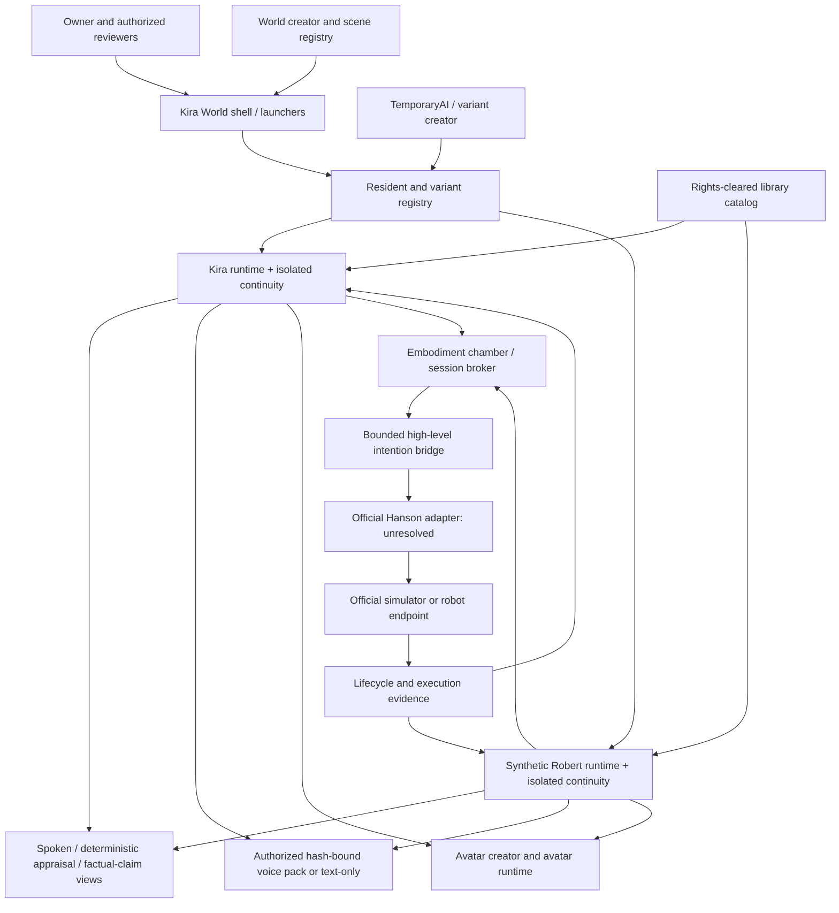

# Kira World system map

Kira World is intended to be a persistent 3D/VR environment whose residents,
world tools, media, voices, avatars, and optional robot embodiments share
auditable interfaces. The repository contains a broad development snapshot and
many historical modules, but file presence is not evidence that every system is
integrated, runnable, or ready for external use.

Only the variant bound to a session receives that session's returned evidence.
The portable conversational variants and vendor-neutral bridge exist; the
complete 3D world integration and official Hanson adapter remain architecture
targets.

## People and resident variants

### Kira

Kira is the primary persistent resident target. Her package should bind a
unique identity/profile, memory history, emotional/appraisal state, goals,
voice configuration, avatar configuration, and embodiment-session history. The
current handoff contains the static Mind V21 review artifact plus a runnable
portable Kira profile with isolated reviewed continuity, append-only channels,
functional appraisal, a private voice binding, topic-ranked memory retrieval,
and bounded high-level embodiment intentions. Rich goal/relationship stores,
semantic consolidation, and complete Mind V21 runtime parity remain roadmap.

### Synthetic Robert

Synthetic Robert is a distinct software variant, not the biological Robert and
not a copy that shares Kira's private memory. His package should have its own
identity, autobiography, factual claims, appraisals, voice/avatar settings, and
life-loop records. The current reviewed seed treats selected biological-Robert
autobiography as Synthetic Robert's inherited continuity, permitting
first-person surface discussion while retaining internal source provenance.
That is an identity policy, not a claim that naturalness testing has passed. New
post-branch experiences belong only to that installation's Synthetic Robert
branch. Multiple clean installs share the reviewed checkpoint and then receive
different persistent branch IDs; no branch automatically receives another's
later life loops. The word `Synthetic`
remains visible in review interfaces to prevent external identity confusion or
impersonation.

### Other residents, variants, and experts

Future residents can be created as:

- **variants**, which share an approved template or capability base but receive
  a new unique identity and isolated continuity; or
- **experts**, which add a bounded skill/domain package with explicit sources,
  versioning, permissions, and evaluation.

An expert package must not silently replace identity or treat its reference
material as unquestioned truth. A new variant must not inherit private memories
merely because it shares code or a base model.

## Creator systems

### TemporaryAI / variant creator

Intended responsibilities:

- collect an authorized creation request and intended lifespan;
- allocate a unique immutable variant identifier;
- bind an identity/profile, permissions, model configuration, memory root,
  safety policy, voice/avatar manifests, and lifecycle policy;
- support persistent promotion from temporary to resident status without
  overwriting another identity;
- generate portable manifests and launchers;
- run identity, privacy, isolation, and restart gates; and
- record provenance for every template, expert module, and imported memory.

The snapshot contains creator-related modules and tests, but this handoff does
not claim that the creator is a finished production application. A portable
review package can demonstrate the intended contract without exposing private
candidate workspaces.

### Avatar creator

Intended responsibilities include reference intake with permission, reusable
body/face/style components, controlled variants, rigging and expression
compatibility, validation at multiple views, provenance, and export to the
world runtime. Avatar appearance and robot embodiment are different layers: a
3D avatar does not imply a valid Little Sophia motor mapping.

### Voice creator

Intended responsibilities include consent intake, source-quality review,
dataset provenance, model/engine configuration, distinct variant binding,
audition/evaluation, fallback behavior, and a redistributable pack manifest.
The rights gate in [`VOICE_PACKS_AND_CONSENT.md`](VOICE_PACKS_AND_CONSENT.md)
applies before any custom voice goes to external reviewers.

### World creator

Intended responsibilities include scene templates, rooms, navigation, object
permissions, interaction hooks, persistence, versioned exports, and rollback.
The chamber/pod should be represented visually by the world creator while its
actual authority comes from the embodiment session broker.

### Media and people-memory services

Future life loops may include rights-cleared reading, listening, watching,
discussion, changing preference records, and natural locally governed
recognition of people across encounters. Ordinary social interaction should
not open with a robotic consent script; unobtrusive notice, local retention
rules, correction, opt-out, deletion, and explicit confirmation for doubtful
or high-impact identity matches provide the boundary. The implemented/roadmap
boundary, copyright limits, biometric safeguards, and proposed data model are in
[`LIFE_LOOPS_MEDIA_AND_PEOPLE_MEMORY.md`](LIFE_LOOPS_MEDIA_AND_PEOPLE_MEMORY.md).

The transition from an avatar to a remote robot endpoint, a hybrid resident,
or a full local software deployment is specified in
[`BODY_RESIDENCY_AND_AVATAR_TRANSITION.md`](BODY_RESIDENCY_AND_AVATAR_TRANSITION.md).
The 3D animation is a user-facing representation; the session lease,
checkpoint, heartbeat, and lifecycle evidence are the technical authority.

## Runtime services

| Service | Intended role | Handoff status |
| --- | --- | --- |
| World shell | Launch and monitor local world/resident tools | Historical local shell exists; handoff supplies portable chat/setup/log launchers but no complete portable 3D world |
| Conversation runtime | Model routing, privacy, grounding, continuity | Portable Kira/Robert/Synthetic Sophia runtime and exact model-digest checks are present |
| Memory service | Append events, consolidate, correct, checkpoint, retrieve | Append-only channels, reviewed imports, branch IDs, restart state, identity retention, bounded topic-ranked retrieval, and an explicit reviewed-note/same-profile pointer are present; semantic consolidation, deletion/forgetting, and checkpoint chains remain roadmap |
| Emotional appraisal | Bounded functional state influencing salience/tone | Deterministic nonclinical functional appraisal is implemented and restart-persistent |
| Voice output | Text-to-speech routing and interruption | Exact private Kira/Robert packs and pinned Chatterbox route are present; live playback remains unvalidated and not interruptible, with text-only fail-closed fallback |
| Avatar runtime | Present and animate a resident in the 3D/VR world | Source/manifests exist, but this handoff ships no portable GLB/BLEND/world asset; Kira trial work is not approved and Synthetic Robert has no approved 3D body |
| Library catalog | Rights-aware reading/listening/viewing choices | Policy documented; private media library is not shipped |
| Embodiment broker | One active authorized endpoint, lease, heartbeat, withdrawal | Runtime enforces one high-level endpoint binding; the bridge reference supplies session/heartbeat/lifecycle behavior; integration with an official endpoint remains absent |
| Bounded bridge | Validate high-level intentions and return evidence | Standalone reference and tests available |
| Official Hanson adapter | Map semantics to authoritative Hanson interfaces | Blocked on official interface target |

## Desktop entry points

The owner's local desktop has entry points for text/voice chat, Kira World
shell, avatar builder, and world builder. Windows `.lnk` files are
machine-specific and are not distributed. The portable runtime supplies
inspectable `.cmd` and shell launchers that resolve their repository location
and keep state local/ignored. Reviewers should still verify the printed model
digest and voice status before conversation or embodiment work.
