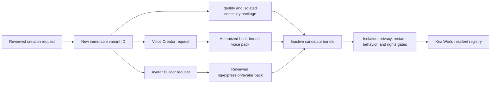

# TemporaryAI Creator: current status and integration path

Status reviewed: 2026-08-20

The TemporaryAI Creator is the broader Kira World authoring system for making
new residents, variants, and bounded experts. It is not just a prompt copier.
Its intended output is a portable, identity-isolated package that can acquire
reviewed experiences over life loops without merging with Kira or another
resident.

The local development workspace currently contains about 7,521 files under
the TemporaryAI area. That inventory includes historical attempts, archived
candidates, generated project loops, disabled acceptance bindings, and test
evidence. File count is not proof that the Creator is production-ready, and
the complete private workspace is not included in this handoff.

## What exists and is useful now

- creation-request, identity-profile, and memory templates;
- separate candidate and archived-candidate directories;
- activation plans, source-research queues, reliable-source packs, and
  research summaries for several candidate types;
- per-candidate workbench folders and repeatable project-loop records;
- a distinction between resident variants and domain experts;
- original-voice-forge job/bundle schemas, authorization records, watermark
  evidence, and model-input manifests;
- early shared-growth and person-specification contracts; and
- provenance, archive, and static acceptance/rejection records.

These parts are useful design and migration inputs. They are not a single
clean installable Creator release, and disabled or rejected artifacts do not
become working features merely because they remain on disk.

## What still needs improvement

1. Collapse the many historical formats into one versioned creation-request,
   person-profile, memory-bootstrap, voice, avatar, and activation manifest.
2. Add a clean-room installer and one supported command/API that creates a new
   package without reading unrelated private candidate folders.
3. Require a unique immutable variant ID, isolated local-data root, profile
   hash, and explicit import allowlist before the first life loop.
4. Add correction, supersession, dispute, forgetting/tombstone, relationship,
   preference, and goal records to the portable continuity runtime.
5. Finish a pinned, tested Voice Creator route with recipient-specific rights,
   reference-quality review, cross-platform inference choices, audition, and
   hash-bound output manifests.
6. Finish a repeatable Avatar Builder route that emits validated rigged assets,
   expressions/visemes, provenance, and multiple reviewed variants instead of
   one-off Blender experiments.
7. Connect Creator outputs to the Kira World resident registry and launchers
   without granting automatic activation, body access, or access to another
   resident's memory.
8. Run clean-checkout, restart, replay, privacy, model-change, voice, avatar,
   and long life-loop evaluations before promotion.

## Intended Creator -> Voice Creator -> Avatar Builder flow

Every output must carry the same variant ID but remain a separate replaceable
layer. Changing a voice or avatar must not rewrite identity, memories, factual
claims, relationships, or goals. A failed voice/avatar build must not erase a
valid mind package. Registration makes a software package available to the
world shell; it does not prove consciousness, personhood, or permission to
operate a robot.

## Relationship to this David handoff

The portable Kira and Synthetic Robert packages exercise the identity,
continuity, appraisal, evidence-channel, and embodiment boundaries that a
future Creator should emit. They are not proof that the full Creator can yet
reproduce them from one button. David's team may review the contracts and help
define official embodiment inputs without receiving the raw 7,521-file private
candidate workspace.

Educational examples and the exact positive/negative portable-runtime tests are
documented in
[`TRANSFORMATIVE_VARIANTS_AND_EXPERTS.md`](TRANSFORMATIVE_VARIANTS_AND_EXPERTS.md).
