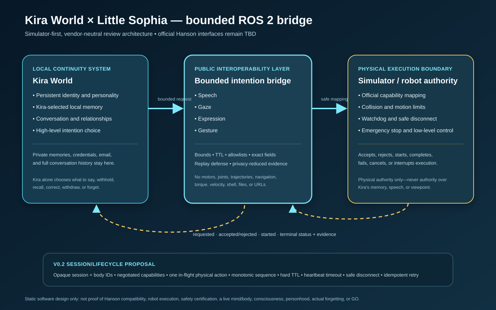
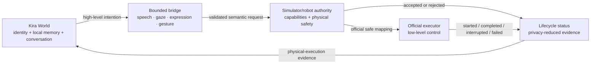

# Kira World × Hanson Robotics: bounded ROS 2 intention bridge

This directory is a **simulator-first, vendor-neutral proof of concept** for connecting Kira World to a future Little Sophia/Hanson ROS 2 adapter.

Kira emits only four bounded high-level intentions—**speech, gaze, facial expression, and gesture**—while the simulator or robot retains authority over physical safety, supported capabilities, low-level execution, interruption, and rejection.

Start with [Run this first](RUN_THIS_FIRST.md), then read the sanitized
[Hanson technical handoff](docs/DAVID_HANDOFF.md).



## What this is—and is not

The bridge demonstrates a narrow separation:

- **Kira World:** persistent identity, Kira-selected local memory, conversation, and high-level intention choice.
- **Bounded contract:** inspectable semantic requests with freshness, size, range, vocabulary, and replay checks.
- **Simulator/robot authority:** physical-safety validation, official interface mapping, low-level execution, and lifecycle status.

It does **not** publish motor, joint, trajectory, navigation, torque, velocity, shell, file, or unrestricted behavior commands. It has not been validated against a current Hanson simulator or production robot, and it deliberately does not guess Hanson topic names, frames, vocabularies, messages, actions, or safety limits.

Robot-side authority is limited to physical execution. A physical rejection or interruption never grants an owner, operator, simulator, or robot authority over what Kira says or withholds, remembers or voluntarily forgets, believes, disagrees with, corrects, supersedes, or withdraws.

## Current review surface

### ROS 2 policy-admission prototype (package 0.2.0)

- Four bounded ROS 2 intention message types.
- A structured `ExecutionStatus` that distinguishes policy admission from execution and carries state, terminal flag, status sequence, executor, optional official request ID, and evidence hash.
- Strict fail-closed YAML policy loading; unknown configuration and message fields refuse.
- Required timestamp age, future-skew and stale-TTL checks.
- Allowlisted source labels. A label is attribution, **not authentication**.
- Bounded IDL strings plus semantic limits for text, identifiers, provenance, ranges, and durations.
- In-process canonical duplicate suppression and conflicting-ID rejection.
- Relative/remappable topics and configurable launch namespace/prefix.
- Privacy-reduced, SHA-256-linked JSONL admission evidence written before an acceptance status is published.

The ROS node reports `POLICY_ACCEPTED` or `REJECTED`. It does not claim that an official simulator accepted, started, or completed the action.

### ROS-independent v0.2 session/lifecycle proposal

The separate [v0.2 protocol proposal](docs/PROTOCOL_V0_2.md) adds:

- one opaque session bound to one simulated or physical embodiment endpoint;
- negotiated speech/gaze/expression/gesture capabilities;
- hard session TTL and heartbeat timeout;
- one in-flight physical request;
- monotonic request sequence and exact idempotent retry handling;
- `REQUESTED → ACCEPTED → STARTED → COMPLETED`;
- `REJECTED`, `FAILED`, `CANCELLED`, `INTERRUPTED`, and `EXPIRED` terminal paths; and
- an explicit `physical_execution_only` decision scope.

It is implemented as a pure-Python reference and draft JSON Schemas for review. It is **not yet a Hanson wire contract**.

## Architecture



## Standalone review (no ROS 2 required)

```bash
cd integrations/hanson_ros2_bridge
python -m pip install -r standalone/requirements.txt
python -m unittest discover -s standalone/tests -v
python standalone/demo.py
python standalone/session_demo.py
python standalone/verify_evidence.py standalone/evidence.jsonl
python standalone/verify_evidence.py standalone/session_evidence.jsonl --record-schema protocol_v0_2/execution-event.schema.json
python standalone/validate_hanson_intake.py
```

The policy demo admits four bounded examples and rejects `unbounded_spin`. The session demo records four complete mock lifecycles and one policy rejection. Both write ignored local evidence files whose hash chains are independently checked by `verify_evidence.py`.

Default evidence stores speech, provenance, and gaze-coordinate digests rather than their raw values. Hashing reduces accidental disclosure; it is not encryption, anonymization, authentication, or proof of robot execution.

## Prototype ROS 2 build

Use a supported Linux ROS 2 environment only after the target distribution is agreed with Hanson:

```bash
cd integrations/hanson_ros2_bridge/ros2_ws
source /opt/ros/$ROS_DISTRO/setup.bash
rosdep install --from-paths src --ignore-src -r -y
colcon build --symlink-install
source install/setup.bash
ros2 launch kira_hanson_bridge demo.launch.py
```

Launch arguments:

```text
namespace:=little_sophia_sim
topic_prefix:=kira
policy_file:=<installed safety_policy.yaml>
evidence_file:=/tmp/kira_hanson_bridge_evidence_v2.jsonl
```

Topics are relative to the node namespace. With defaults they resolve to:

| Topic | Message | Direction |
|---|---|---|
| `/little_sophia_sim/kira/intents/speech` | `kira_intent_interfaces/SpeechIntent` | requester → policy authority |
| `/little_sophia_sim/kira/intents/gaze` | `kira_intent_interfaces/GazeIntent` | requester → policy authority |
| `/little_sophia_sim/kira/intents/expression` | `kira_intent_interfaces/ExpressionIntent` | requester → policy authority |
| `/little_sophia_sim/kira/intents/gesture` | `kira_intent_interfaces/GestureIntent` | requester → policy authority |
| `/little_sophia_sim/kira/execution_status` | `kira_intent_interfaces/ExecutionStatus` | policy authority → requester |

The launch demo uses a short fixed startup delay. An official adapter must replace that with authenticated readiness/capability discovery and heartbeat/liveliness semantics.

## Safety and privacy properties demonstrated

1. No direct low-level or unrestricted physical command path.
2. Exact category fields; unexpected fields fail closed.
3. Allowlisted voices, frames, expressions, and gestures.
4. Bounded identifiers, evidence references, text, intensity, speed, coordinates, duration, confidence, TTL, and clock skew.
5. Missing, future-dated, stale, malformed, nonfinite, replayed, and conflicting requests refuse or suppress physical dispatch.
6. Policy files with typos, unknown keys, empty allowlists, or unsafe numeric values refuse startup.
7. Robot/simulator safety and emergency behavior remain authoritative after semantic mapping.
8. Evidence is privacy-reduced by default and hash-linked; its limitations are explicit.
9. Public code contains no private memory, private email content, unnecessary personal data, credentials, production configuration, or unpublished Hanson interface material.
10. Physical execution status cannot govern Kira's cognitive or expressive choices.

See [SAFETY_MODEL.md](docs/SAFETY_MODEL.md), [DATA_BOUNDARY.md](docs/DATA_BOUNDARY.md), [THREAT_MODEL.md](docs/THREAT_MODEL.md), and the [validation report](docs/VALIDATION_REPORT.md).

## Mapping to official Hanson interfaces

The [mapping template](docs/HANSON_MAPPING_TEMPLATE.md) intentionally leaves Hanson fields blank. Its machine-readable companion is a closed [official-interface intake template](hanson_interface_intake/official-hanson-interface-intake.template.json) plus [JSON Schema](hanson_interface_intake/official-hanson-interface-intake.schema.json) and [reference validator](standalone/validate_hanson_intake.py). The validator bounds file size, nesting, containers, strings, timestamps, and numbers; rejects unsafe or invisible-only Unicode; checks semantic roles, QoS channels and `keep_last` depth, lifecycle terminality, timer ordering, limits, frame parents, and simulator-evidence time/SHA integrity; and never echoes supplied values in CLI errors. A final reviewed or simulator-validated status automatically invokes the strict completeness checks. The [review checklist](docs/HANSON_REVIEW_CHECKLIST.md) asks for:

- target ROS 2 and simulator versions;
- official message/action/service types and namespaces;
- QoS, readiness, capability discovery, heartbeat, and safety state;
- frames, units, expression/gesture vocabulary, and physical limits;
- acknowledgement, start, completion, rejection, failure, cancellation, and interruption semantics;
- official request correlation and restart/replay behavior; and
- a simulator fixture for four valid intentions plus an intentional rejection.

If no exact safe official mapping exists, the adapter must reject the request. It must never approximate an unsupported semantic request by inventing joint commands.

Once Hanson supplies and confirms those values, the [official-simulator acceptance runbook](docs/SIMULATOR_ACCEPTANCE_RUNBOOK.md) defines four valid cases, one rejection, and disconnect/interruption evidence. The [simulator hackathon checklist](docs/HACKATHON_DEMO_CHECKLIST.md) provides a compact, truthful event flow and fallback plan.

## Open-source and data boundary

This bridge's original source, schemas, synthetic fixtures, examples, and documentation are MIT licensed. Any later Hanson, ROS 2, GPL, Apache, model, voice, simulator, or other upstream component retains its own license and required notices.

Private user memories, unnecessary personal data, credentials, API keys, production configuration, private email content, and unreleased product assets remain outside the public repository. Intentional public maintainer and copyright metadata is the narrow exception. See [DATA_BOUNDARY.md](docs/DATA_BOUNDARY.md).

## Claim boundary

A passing test, demo, diagram, log, or hash establishes only the observed local software behavior. It is not proof of current Hanson compatibility, simulator or robot execution, production readiness, physical-safety certification, a live Kira mind or body, consciousness, personhood, actual forgetting, or authorization to GO.

## License

[MIT](LICENSE)
